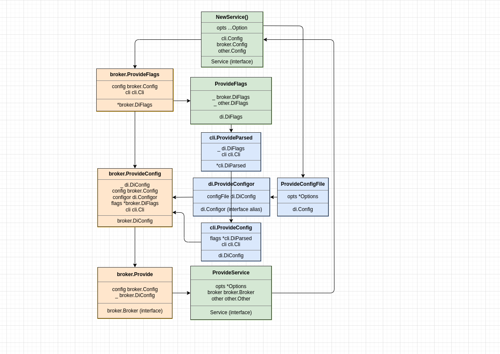

# Go Micro v5 [](https://opensource.org/licenses/Apache-2.0) [](https://pkg.go.dev/github.com/go-micro/microwire/v5?tab=doc) [](https://goreportcard.com/report/github.com/go-micro/go-micro) [](https://discord.gg/qV3HvnEJfB)

Go Micro is a framework for distributed systems development.

Have a look at [examples](https://github.com/go-micro/microwire-examples) for examples.

## v5 is a proof of concept - DO NOT USE

v5 intodruces wire generated code.

See this Diagram for an overview:



### Goals

- Add backward incompatible lint fixes
- Remove all globals
- Backward compatiblity is not required at all places but a nice to have
- Replace [util/cmd](https://github.com/go-micro/go-micro/tree/master/util/cmd)
- Choose what features you want from go-micro:
  - You can select if you want Auth/Events/"name it here"
  - If you don't want CLI opts you can exclude them
  - No default plugins, that makes the core even slimer
- Choose your Prefix for CLI opts not only "micro"
- No more Globals, everything lives in the DI
- wire for the end users will allow them wire theier app together
- Easy to make a micro Service and a monolith with the same codebase

### Implemented features

- util/cmd/ is gone
- web/ is gone
- config/source/(env|file) is gone
- 6 components, component generator so easy to add them all
- Cli is a component now, its easy to replace it with other flag+env plugins
- ArgPrefix("myapp") for micro flags and environment vars
- NoFlags() option, this will disable all micro flags
- Config() option, to provide a config file
- Each component reads the configuration by its own, config is tightly coupled

### Default yaml config

```yaml
---
Broker:
    Enabled: true
    Plugin: http
Client:
    Enabled: true
    Plugin: rpc
    PoolSize: 1
    PoolTTL: 1m
    PoolRequestTimeout: 5s
    PoolRetries: 1
Server:
    Enabled: true
    Plugin: rpc
    RegisterTTL: 30
    RegisterInterval: 60
Registry:
    Enabled: true
    Plugin: mdns
Transport:
    Enabled: true
    Plugin: http
```

### Example yaml config

```yaml
---
Broker:
    Enabled: true
    Plugin: nats
    Addresses:
        - nats://localhost:4222
Client:
    Enabled: true
    Plugin: grpc
    PoolSize: 100
    PoolTTL: 5m
    PoolRequestTimeout: 10s
    PoolRetries: 5
Server:
    Enabled: true
    Plugin: grpc
    RegisterTTL: 30
    RegisterInterval: 60
Registry:
    Enabled: true
    Plugin: nats
    Addresses:
        - nats://localhost:4222
Transport:
    Enabled: true
    Plugin: quic
```

## Overview

Go Micro provides the core requirements for distributed systems development including RPC and Event driven communication.
The Go Micro philosophy is sane defaults with a pluggable architecture. We provide defaults to get you started quickly
but everything can be easily swapped out.

## Features

Go Micro abstracts away the details of distributed systems. Here are the main features.

- **Authentication** - Auth is built in as a first class citizen. Authentication and authorization enable secure
  zero trust networking by providing every service an identity and certificates. This additionally includes rule
  based access control.

- **Dynamic Config** - Load and hot reload dynamic config from anywhere. The config interface provides a way to load application
  level config from any source such as env vars, file, etcd. You can merge the sources and even define fallbacks.

- **Data Storage** - A simple data store interface to read, write and delete records. It includes support for memory, file and
  CockroachDB by default. State and persistence becomes a core requirement beyond prototyping and Micro looks to build that into the framework.

- **Service Discovery** - Automatic service registration and name resolution. Service discovery is at the core of micro service
  development. When service A needs to speak to service B it needs the location of that service. The default discovery mechanism is
  multicast DNS (mdns), a zeroconf system.

- **Load Balancing** - Client side load balancing built on service discovery. Once we have the addresses of any number of instances
  of a service we now need a way to decide which node to route to. We use random hashed load balancing to provide even distribution
  across the services and retry a different node if there's a problem.

- **Message Encoding** - Dynamic message encoding based on content-type. The client and server will use codecs along with content-type
  to seamlessly encode and decode Go types for you. Any variety of messages could be encoded and sent from different clients. The client
  and server handle this by default. This includes protobuf and json by default.

- **RPC Client/Server** - RPC based request/response with support for bidirectional streaming. We provide an abstraction for synchronous
  communication. A request made to a service will be automatically resolved, load balanced, dialled and streamed.

- **Async Messaging** - PubSub is built in as a first class citizen for asynchronous communication and event driven architectures.
  Event notifications are a core pattern in micro service development. The default messaging system is a HTTP event message broker.

- **Event Streaming** - PubSub is great for async notifications but for more advanced use cases event streaming is preferred. Offering
  persistent storage, consuming from offsets and acking. Go Micro includes support for NATS Jetstream and Redis streams.

- **Synchronization** - Distributed systems are often built in an eventually consistent manner. Support for distributed locking and
  leadership are built in as a Sync interface. When using an eventually consistent database or scheduling use the Sync interface.

- **Pluggable Interfaces** - Go Micro makes use of Go interfaces for each distributed system abstraction. Because of this these interfaces
  are pluggable and allows Go Micro to be runtime agnostic. You can plugin any underlying technology.

## Getting Started

To make use of Go Micro

```go
package main

import (
    _ "github.com/go-micro/microwire-plugins/sets/defaults/v5"
    micro "github.com/go-micro/microwire/v5"
    "github.com/go-micro/microwire/v5/logger"
)

func main() {
    service, err := micro.NewService(
        micro.Name("livecyclehooks"),
        micro.Usage("A POC for go-micro.dev/v5"),
        micro.Version("v0.0.1"),
        micro.ArgPrefix(""),
    )
    if err != nil {
        logger.Fatal(err)
    }

    if err := service.Run(); err != nil {
        logger.Fatal(err)
    }
}
```

See the [examples](https://github.com/go-micro/examples) for detailed information on usage.

## Toolkit

See [github.com/go-micro](https://github.com/go-micro) for tooling.

- [API](https://github.com/go-micro/api)
- [CLI](https://github.com/go-micro/cli)
- [Demo](https://github.com/go-micro/demo)
- [Plugins](https://github.com/go-micro/plugins)
- [Examples](https://github.com/go-micro/examples)
- [Dashboard](https://github.com/go-micro/dashboard)
- [Generator](https://github.com/go-micro/generator)

## Changelog

See [CHANGELOG.md](https://github.com/micro/go-micro/tree/master/CHANGELOG.md) for release history.

## License

Go Micro is Apache 2.0 licensed.
